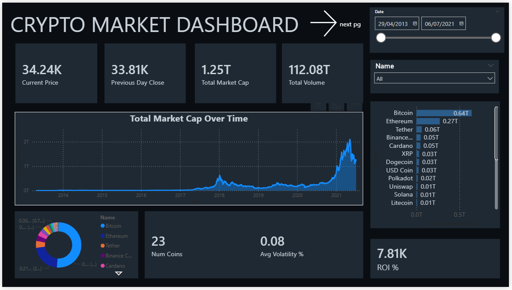
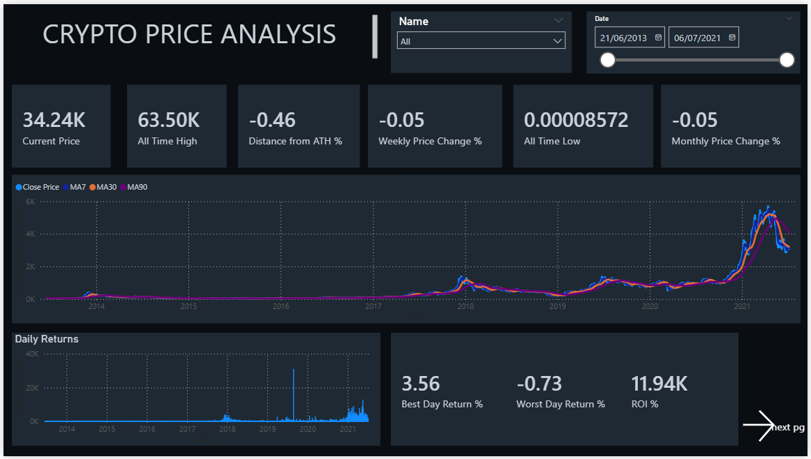
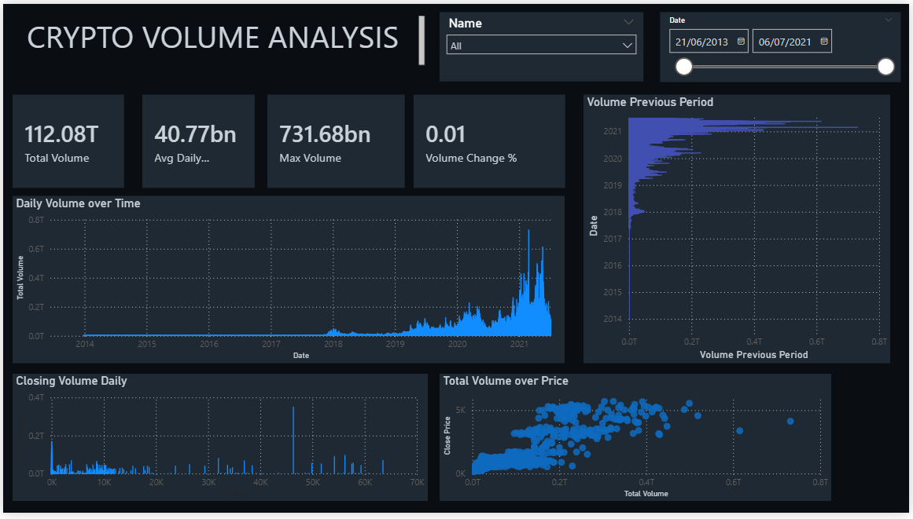

# 📊 Crypto Market Power BI Dashboard

An interactive multi-page Power BI dashboard analyzing cryptocurrency market trends, price movements, and trading volume from **2013 to 2021**, covering 23 coins including Bitcoin, Ethereum, and more.

---

## 🖼️ Dashboard Preview

### Page 1 – Crypto Market Overview


### Page 2 – Crypto Price Analysis


### Page 3 – Crypto Volume Analysis


---

## 📁 Repository Structure

```
crypto-dashboard/
├── README.md
├── crypto_dashboard.pbix       ← Power BI report file
├── data/
│   └── crypto_data.csv         ← Source dataset
└── images/
    ├── dash_1.png              ← Market Overview page
    ├── dash_2.png              ← Price Analysis page
    └── dash_3.png              ← Volume Analysis page
```

---

## 📌 Dashboard Pages

### 1. Crypto Market Dashboard
- **KPIs:** Current Price, Previous Day Close, Total Market Cap, Total Volume
- **Charts:** Total Market Cap Over Time, Market Share Donut Chart, Market Cap by Coin (bar)
- **Stats:** Number of Coins (23), Avg Volatility %, ROI %
- **Filters:** Date range slider, Coin Name slicer

### 2. Crypto Price Analysis
- **KPIs:** Current Price, All Time High, Distance from ATH %, Weekly & Monthly Price Change %, All Time Low, ROI %
- **Charts:** Close Price with MA7, MA30, MA90 moving averages, Daily Returns bar chart
- **Stats:** Best Day Return % (3.56), Worst Day Return % (-0.73), ROI % (11.94K)
- **Filters:** Date range slider, Coin Name slicer

### 3. Crypto Volume Analysis
- **KPIs:** Total Volume (112.08T), Avg Daily Volume (40.77bn), Max Volume (731.68bn), Volume Change %
- **Charts:** Daily Volume Over Time (area chart), Volume Previous Period (horizontal bar), Closing Volume Daily (scatter), Total Volume over Price (scatter)
- **Filters:** Date range slider, Coin Name slicer

---

## 📂 Dataset

| Field | Description |
|---|---|
| `Name` | Cryptocurrency name (e.g., Bitcoin, Ethereum) |
| `Date` | Trading date |
| `Close` | Closing price (USD) |
| `Volume` | Daily trading volume |
| `Market Cap` | Market capitalization |

- **Date Range:** April 2013 – July 2021
- **Coins Covered:** 23 (Bitcoin, Ethereum, Tether, Binance Coin, Cardano, XRP, Dogecoin, and more)
- **Source:** Public cryptocurrency market data

---

## 🛠️ Tools Used

| Tool | Purpose |
|---|---|
| Power BI Desktop | Dashboard creation & DAX measures |
| CSV | Data source |
| DAX | KPI calculations (ATH, ROI, Moving Averages, Volatility) |

---

## 🔑 Key Insights

- **Bitcoin dominates** market cap at 0.64T, followed by Ethereum at 0.27T
- **2021 bull run** saw the highest total market cap ever (~2T) and peak daily volumes exceeding 0.8T
- **ROI of 7.81K%** across the full period reflects crypto's exponential growth
- **Average volatility** across all coins stands at 0.08%
- **All Time High** for the tracked period was $63.50K

---

## 🚀 How to Use

1. Clone or download this repository
2. Open `crypto_dashboard.pbix` in **Power BI Desktop**
3. Use the **Name** slicer to filter by individual cryptocurrency
4. Adjust the **Date** range slider to explore specific time periods
5. Navigate between pages using the **"next pg →"** button in the dashboard

---

## 📬 Contact

Feel free to connect or raise an issue if you have feedback or questions!
